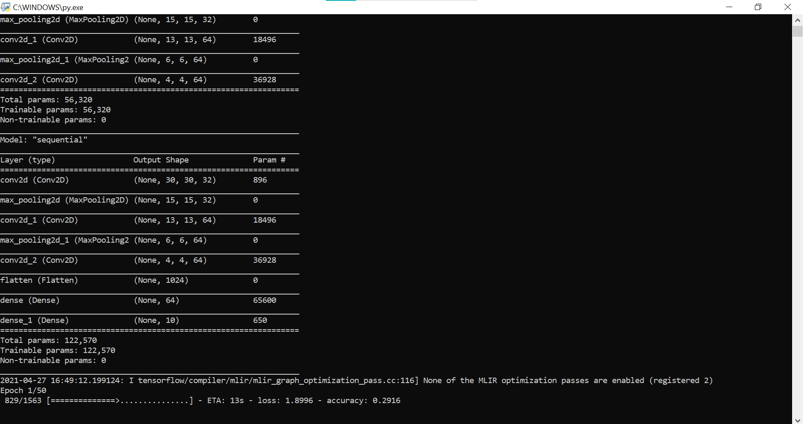
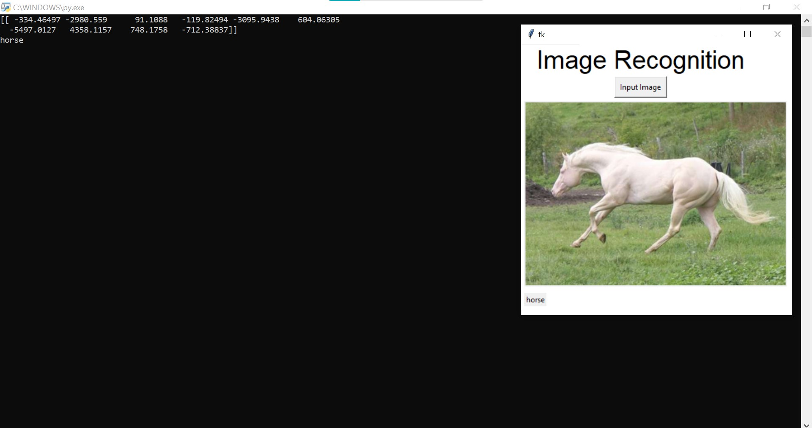
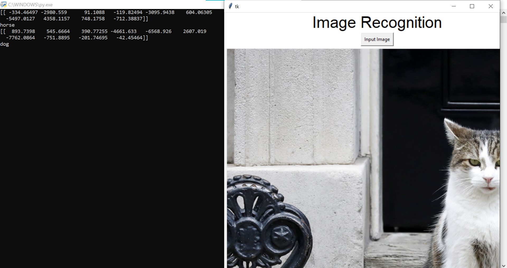

# Image Recognition Software

<!-- LOGO -->
<br />
<p align="center">
  <a href="https://github.com/Yashvardhang/CNN">
    
  </a>

  <h3 align="center">Image Recognition Software</h3>
  <p align="center">
    CIFAR-10 Dataset
  </p>
</p>

<!-- TABLE OF CONTENTS -->
<details open="open">
  <summary>Table of Contents</summary>
  <ol>
    <li><a href="#about">About</a></li>
    <li><a href="#requirements">Requirements</a></li>
    <li><a href="#working">Working</a></li>
    <li><a href="#contribute">Contribute</a></li>
    <li><a href="#contact">Contact</a></li>
    <li><a href="#acknowledgements">Acknowledgements</a></li>
  </ol>
</details>

<!-- ABOUT -->
## About

**Image Recognition/Classification Software** uses the **CIFAR-10 Dataset** (Canadian Institute for Advanced Research, 10 Classes). The CIFAR-10 dataset consists of 60000 32x32 colour images in 10 classes, with 6000 images per class. There are 50000 training images and 10000 test images. <br>

The classes present in the Dataset are:
<ul>
  <li>Airplane</li>
  <li>Automobile</li>
  <li>Bird</li>
  <li>Cat</li>
  <li>Deer</li>
  <li>Dog</li>
  <li>Frog</li>
  <li>Horse</li>
  <li>Ship</li>
  <li>Truck</li>
</ul>

The dataset is divided into five training batches and one test batch, each with 10000 images. The test batch contains exactly 1000 randomly-selected images from each class. The training batches contain the remaining images in random order, but some training batches may contain more images from one class than another. Between them, the training batches contain exactly 5000 images from each class.<br>

The purpose of creating this system is in order to know more about the intricacies of AI and develop on the pre-existing grounds of Image Recognition. Image Recognition as a concept can solve a wide spectrum of issues in real world, from security applications to even real-time detection for physcially challenged people. This Image Recogniton software builds grounds for further research and development. Feel free to add on to this project and develop this system furtheron. Head on to the <a href="#contribute">Contribution</a> section to know more on how to do so.

**Note:** The dataset is downloaded as soon as you open the main code, but you may also download the CIFAR-10 Dataset Externally. To download the CIFAR-10 Dataset, head on to <a href = 'https://www.cs.toronto.edu/~kriz/cifar.html'>CIFAR-10</a> website.
<br><br>

<!-- REQUIREMENTS -->
## Requirements

List of Pre-Requisite Python Modules:

```
 > pip install tensorflow
 > pip install keras
 > pip install matplotlib
 > pip install numpy
 > pip install tk
```

**Note:** It is advisable to upgrade your pip before installing **Tensorflow.**
<br>

<!-- WORKING -->
## Working

This Image Recognition/Classification System can be broken down into 2 basic Algorithms:
<ol>
  <li><b>CNN Training:</b><br>This is the primary step and the most important algorithim in this CNN. It loads the CIFAR-10 Dataset, creates classes and trains the network to create a data model which can be further used to classify the images using a GUI. This step has been included in the <b>Training</b> source code in the rep.</li><br>
  <li><b>Classification Testing:</b><br>This is the secondary step of a CNN which includes the usage of the created data model in the previous step. In this step we have created a GUI using the Python library 'Tkinter', which inputs an image from the user and tries to classify it in either of the 10 classes. This GUI can be accessed in the <b>Testing</b> source code. </li><br>
</ol>

While **Training** the dataset, the ConvNet was made to run through a total of **50 Epochs**, and this resulted in the end accuracy of **90%+**. This dataset was saved and compiled as  _dataset.h5_ and is readily available with the source codes and can be acessed easily. A set of pre-downloaded images have been provided in another folder names _Images_, in which 2 are taken directly from the dataset itself. The images were then inputted through the GUI in the Testing source code, and classified all images correctly **except one**. This proved that the model doesn't have a 100% accuracy and is partially accurate.
<br><br>
<p align = "center">
  
  <b><h4 align = "center">Training the Dataset</h4></b>
  <br>
  
  <b><h4 align = "center">Correctly identified as 'Horse'</h4></b>
  <br>
  
  <b><h4 align = "center">All except one identified wrong <br><i>(Cat identified as 'Dog')</i></h4></b>
  <br>
</p>

**Note:** Only **PNG** image files are supported in this recognition system.
<br><br>

<!-- contribute -->
## Contribute

Every program is ever evolving and, that is possible only with valuable contributions. Any contributions you make are greatly appreciated. 
<ol>
  <li>Fork the Project</li>
  <li>Create your Feature Branch (git checkout -b functionalities/Feature)</li>
  <li>Commit your Changes (git commit -m 'Add a Feature')</li>
  <li>Push to the Branch (git push origin functionalities/Feature)</li>
  <li>Open a Pull Request</li>
</ol>

<br>If you have any further ideas or comments, go ahead to the next section and feel free to connect! 

<!-- CONTACT -->
## Contact
This project was made by <a href = 'https://github.com/YashvardhanG'>Yashvardhan Gupta</a> and <a href = 'https://github.com/satwikasridhar'>Satwika Sridhar</a>
<br>
<p align="center">
  <br>
  <br>
  <a href = "https://www.spiralcosmos.com">Spiral Cosmos</a>
</p>

<!-- Acknowledgement -->
## Acknowledgements

<ul>
  <li><a href = "https://www.cs.toronto.edu/~kriz/cifar.html">CIFAR-10 Dataset</a></li>
  <li><a href = "https://www.tensorflow.org/">Tensorflow</a></li>
</ul>
